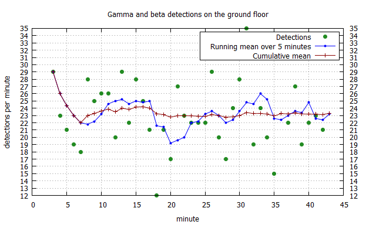

# Radiation Detector

A DIY radiation detector and logger.

## Introduction

The Radiation detector is built using the MightyOhm Geiger Counter Kit and a Raspberry Pi. The standard Geiger-Müller Tube that comes with the Geiger Counter Kit (SBM-20) allows for detection of beta and gamma rays. The *geiger.py* script provided in this repository provides the glue between the two devices and logs the data on the Raspberry Pi. The gnuplot script *plot.plt* can be used to average and display the data.

## Prerequisites

* A [MightyOhm Geiger Counter](http://mightyohm.com/blog/products/geiger-counter/) kit.
* A [Raspberry Pi](https://www.raspberrypi.org/).
* Tools to assemble the geiger counter kit and some wires to connect the geiger counter to the Pi.

## Setup

* Wire everything up according to this image. 

* Copy geiger.py to the Pi and make sure the pins in the code match the ones that were connected!
* Run the script and it will save the data in detections.txt in the same folder.

Optionally
* Set up a systemd service file to run the script on every boot of the Pi.
* Set up X11-forwarding to plot the data in real time using, for example, the provided [gnuplot](http://www.gnuplot.info/) script.
* Use some kind of web API to share the data and make it accessible online.

## Output

A file *detections.txt* is written on the Pi with one line of output for every minute.  
```
Timestamp, minute, detections, μS/h

2020-02-15_12:21:00 3 29 0.1653
2020-02-15_12:22:00 4 23 0.1311
2020-02-15_12:23:00 5 21 0.1197
2020-02-15_12:24:00 6 19 0.1083
2020-02-15_12:25:00 7 18 0.1026
2020-02-15_12:26:00 8 28 0.1596
2020-02-15_12:27:00 9 25 0.1425
```
For the SBM-20 Geiger-Müller Tube the number of detections per minute can be converted to μS/h using the formula 
```
μS/h = detections/minute * 0.0057
```
The explanation for the factor can be found [here](https://www.cooking-hacks.com/documentation/tutorials/geiger-counter-radiation-sensor-board-arduino-raspberry-pi-tutorial#cpm_to_servants).

Running the gnuplot script *plot.plt* should give a graph similar to this (roughly 0.1311 μS/h)


